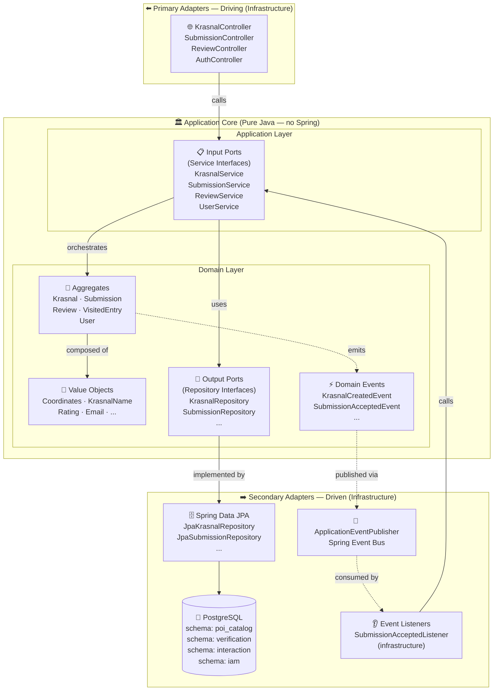
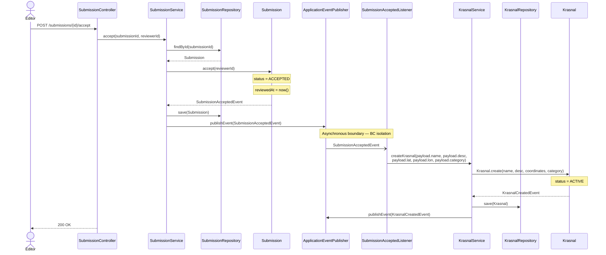
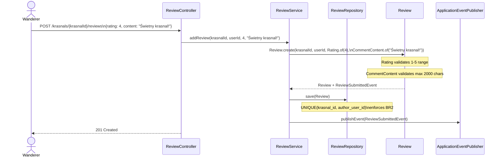
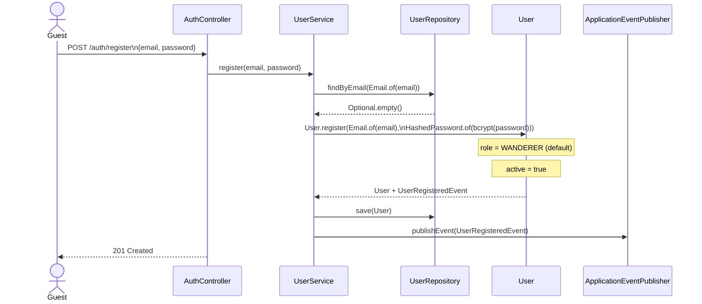
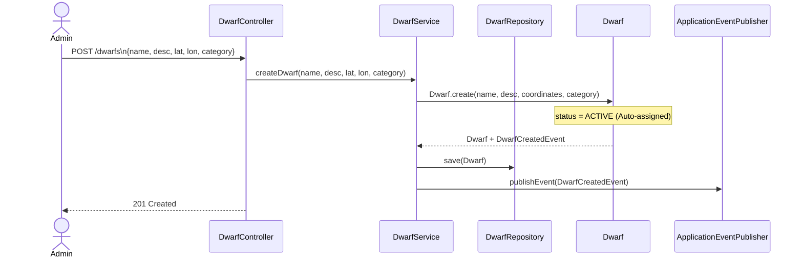

# 02-tactical.md — Taktyczne Projektowanie Systemu
> Krasmap — System mapowania POI utrzymywany przez społeczność
> Odpowiedzialność: Kierownik Taktyki

---

## 1. Decyzje Architektoniczne (Architecture Decision Records)

### ADR-001: Czysta Architektura Heksagonalna (Porty i Adaptery)

| | |
|---|---|
| **Status** | Accepted |
| **Kontekst** | System musi być testowalny niezależnie od frameworka i bazy danych. Logika domenowa nie może być zanieczyszczona infrastrukturą. |
| **Decyzja** | Stosujemy Hexagonal Architecture (Ports & Adapters). Rdzeń systemu (pakiet `domain`) to czysta Java — zero adnotacji Springa, zero zależności od JPA. Spring Boot używany wyłącznie w pakiecie `infrastructure` (adaptery). |
| **Konsekwencje** | (+) Logika domenowa w pełni testowalana przez JUnit bez kontekstu Springa. (+) Wymienność adapterów (np. zamiana PostgreSQL na inną bazę). (-) Więcej interfejsów i klas mapujących. |
| **Zasada SOLID** | Dependency Inversion Principle — domenowe porty wyjściowe (np. `KrasnalRepository`) są interfejsami; adaptery (`JpaKrasnalRepository`) implementują je w warstwie infrastruktury. |

---

### ADR-002: Event-Driven Architecture z ApplicationEventPublisher

| | |
|---|---|
| **Status** | Accepted |
| **Kontekst** | Konteksty nie mogą wołać się nawzajem bezpośrednio — to naruszyłoby izolację Bounded Contexts i stworzyło cykliczne zależności. |
| **Decyzja** | Komunikacja między kontekstami wyłącznie przez Zdarzenia Domenowe. Zdarzenia emituje warstwa aplikacyjna przez `ApplicationEventPublisher` (Spring). Klasy zdarzeń to czyste POJO w warstwie domenowej (bez adnotacji Springa). Listenery to adaptery (`@EventListener` w `infrastructure`). |
| **Konsekwencje** | (+) Pełna izolacja Bounded Contexts. (+) Łatwe dodawanie nowych konsumentów bez modyfikacji producenta. (-) Przepływ sterowania trudniejszy do śledzenia w kodzie. |
| **Zasada SOLID** | Open/Closed Principle — nowy konsument zdarzenia to nowa klasa, bez modyfikacji istniejących. |

---

### ADR-003: Soft Foreign Keys między kontekstami

| | |
|---|---|
| **Status** | Accepted |
| **Kontekst** | Każdy Bounded Context ma własny schemat PostgreSQL. Deklaratywne `FOREIGN KEY` między schematami tworzyłyby ścisłe sprzężenie na poziomie bazy danych — naruszenie izolacji BC. |
| **Decyzja** | Cross-context referencje realizowane jako `BIGINT` bez deklaratywnego `FOREIGN KEY`. Spójność danych gwarantowana przez Domain Events (EDA), nie przez bazę. |
| **Konsekwencje** | (+) Schematy niezależne — można migrować BC niezależnie. (-) Brak automatycznej spójności referencyjnej na poziomie DB — wymaga dyscypliny w kodzie. |

---

### ADR-004: JSONB dla SubmissionPayload

| | |
|---|---|
| **Status** | Accepted |
| **Kontekst** | Zgłoszenie to propozycja Krasnala przed weryfikacją. Struktura danych może się zmieniać (np. dodatkowe pola opcjonalne). Do momentu akceptacji dane nie muszą być znormalizowane. |
| **Decyzja** | `payload_json JSONB` w tabeli `verification.submissions`. Po akceptacji dane są mapowane na `Krasnal` z walidacją Value Objects. |
| **Konsekwencje** | (+) Elastyczna struktura payload bez migracji schematu. (+) Walidacja na poziomie domeny przy akceptacji. (-) Brak silnej typizacji na poziomie DB. |

---

### ADR-005: Miękkie usunięcie kont użytkowników (Soft Delete)

| | |
|---|---|
| **Status** | Accepted |
| **Kontekst** | Twarde usunięcie `User` powodowałoby osierocone rekordy w `interaction.reviews` i `verification.submissions` (soft FK bez kaskady). |
| **Decyzja** | Dezaktywacja konta przez `active = false`. Konto zablokowane (login niemożliwy), dane historyczne (Recenzje, Zgłoszenia) zachowane. |
| **Konsekwencje** | (+) Integralność danych historycznych. (+) Możliwość reaktywacji konta. (-) Tabela `system_users` rośnie. |

---

## 2. Diagram Warstw — Architektura Heksagonalna



---

## 3. Diagramy Klas (UML)

### 3.1 IAM Context

```mermaid
classDiagram
    direction TB

    class User {
        <<Aggregate Root>>
        -UserId id
        -Email email
        -HashedPassword hashedPassword
        -UserRole role
        -boolean active
        -Instant createdAt
        +register(Email, HashedPassword) User
        +deactivate() void
        +activate() void
        +changeRole(UserRole) void
        +isActive() boolean
        +hasRole(UserRole) boolean
    }

    class UserId {
        <<Value Object>>
        -Long value
        +of(Long) UserId
        +getValue() Long
    }

    class Email {
        <<Value Object>>
        -String value
        +of(String) Email
        +getValue() String
        -validate(String) void
    }

    class HashedPassword {
        <<Value Object>>
        -String bcryptHash
        +of(String) HashedPassword
        +matches(String raw) boolean
    }

    class UserRole {
        <<enumeration>>
        GUEST
        WANDERER
        EDITOR
        ADMIN
    }

    class UserRegisteredEvent {
        <<Domain Event>>
        +Long userId
        +String email
        +Instant occurredAt
    }

    class UserRoleChangedEvent {
        <<Domain Event>>
        +Long userId
        +UserRole oldRole
        +UserRole newRole
        +Instant occurredAt
    }

    class UserDeactivatedEvent {
        <<Domain Event>>
        +Long userId
        +Instant occurredAt
    }

    class UserRepository {
        <<Output Port>>
        +save(User) User
        +findById(UserId) Optional~User~
        +findByEmail(Email) Optional~User~
        +findAll() List~User~
    }

    class UserService {
        <<Input Port>>
        +register(String email, String password) User
        +login(String email, String password) User
        +changeRole(Long userId, UserRole newRole) void
        +deactivate(Long userId) void
        +findAll() List~User~
    }

    User *-- UserId
    User *-- Email
    User *-- HashedPassword
    User *-- UserRole
    User ..> UserRegisteredEvent : emits
    User ..> UserRoleChangedEvent : emits
    User ..> UserDeactivatedEvent : emits
    UserService ..> UserRepository : uses
    UserService ..> User : manages
```



---

### 3.2 POI Catalog Context

```mermaid
classDiagram
    direction TB

    class Krasnal {
        <<Aggregate Root>>
        -KrasnalId id
        -KrasnalName name
        -String description
        -Coordinates location
        -KrasnalCategory category
        -KrasnalStatus status
        -Instant createdAt
        -Instant updatedAt
        +create(KrasnalName, String, Coordinates, KrasnalCategory) Krasnal
        +update(KrasnalName, String, KrasnalCategory) void
        +changeStatus(KrasnalStatus) void
        +isVisible() boolean
    }

    class KrasnalId {
        <<Value Object>>
        -Long value
        +of(Long) KrasnalId
        +getValue() Long
    }

    class KrasnalName {
        <<Value Object>>
        -String value
        +of(String) KrasnalName
        +getValue() String
        -validate(String) void
    }

    class Coordinates {
        <<Value Object>>
        -double latitude
        -double longitude
        +of(double lat, double lon) Coordinates
        +getLatitude() double
        +getLongitude() double
        -validateRange() void
    }

    class KrasnalCategory {
        <<enumeration>>
        MONUMENT
        BUILDING
        KRASNAL_FIGURINE
        FLORA
        PLACE
    }

    class KrasnalStatus {
        <<enumeration>>
        ACTIVE
        INACTIVE
        ARCHIVED
    }

    class KrasnalCreatedEvent {
        <<Domain Event>>
        +Long krasnalId
        +String name
        +double latitude
        +double longitude
        +KrasnalCategory category
        +Instant occurredAt
    }

    class KrasnalUpdatedEvent {
        <<Domain Event>>
        +Long krasnalId
        +Instant occurredAt
    }

    class KrasnalStatusChangedEvent {
        <<Domain Event>>
        +Long krasnalId
        +KrasnalStatus oldStatus
        +KrasnalStatus newStatus
        +Instant occurredAt
    }

    class KrasnalRepository {
        <<Output Port>>
        +save(Krasnal) Krasnal
        +findById(KrasnalId) Optional~Krasnal~
        +findAll() List~Krasnal~
        +findByStatus(KrasnalStatus) List~Krasnal~
        +findByCategory(KrasnalCategory) List~Krasnal~
    }

    class KrasnalService {
        <<Input Port>>
        +createKrasnal(String name, String desc, double lat, double lon, KrasnalCategory cat) Krasnal
        +updateKrasnal(Long id, String name, String desc, KrasnalCategory cat) Krasnal
        +changeStatus(Long id, KrasnalStatus status) void
        +findById(Long id) Krasnal
        +findAllActive() List~Krasnal~
        +findByCategory(KrasnalCategory cat) List~Krasnal~
    }

    Krasnal *-- KrasnalId
    Krasnal *-- KrasnalName
    Krasnal *-- Coordinates
    Krasnal *-- KrasnalCategory
    Krasnal *-- KrasnalStatus
    Krasnal ..> KrasnalCreatedEvent : emits
    Krasnal ..> KrasnalUpdatedEvent : emits
    Krasnal ..> KrasnalStatusChangedEvent : emits
    KrasnalService ..> KrasnalRepository : uses
    KrasnalService ..> Krasnal : manages
```



---

### 3.3 Verification Context

```mermaid
classDiagram
    direction TB

    class Submission {
        <<Aggregate Root>>
        -SubmissionId id
        -Long submittedByUserId
        -SubmissionPayload payload
        -SubmissionStatus status
        -String rejectionReason
        -Long reviewedByUserId
        -Instant submittedAt
        -Instant reviewedAt
        +submit(Long userId, SubmissionPayload payload) Submission
        +accept(Long reviewerId) void
        +reject(Long reviewerId, String reason) void
        +isPending() boolean
    }

    class SubmissionId {
        <<Value Object>>
        -Long value
        +of(Long) SubmissionId
        +getValue() Long
    }

    class SubmissionPayload {
        <<Value Object>>
        -String name
        -String description
        -double latitude
        -double longitude
        -String category
        +of(String, String, double, double, String) SubmissionPayload
        +toJson() String
        +fromJson(String) SubmissionPayload
        -validate() void
    }

    class SubmissionStatus {
        <<enumeration>>
        PENDING
        ACCEPTED
        REJECTED
    }

    class SubmissionCreatedEvent {
        <<Domain Event>>
        +Long submissionId
        +Long submittedByUserId
        +Instant occurredAt
    }

    class SubmissionAcceptedEvent {
        <<Domain Event>>
        +Long submissionId
        +Long reviewedByUserId
        +SubmissionPayload payload
        +Instant occurredAt
    }

    class SubmissionRejectedEvent {
        <<Domain Event>>
        +Long submissionId
        +String rejectionReason
        +Instant occurredAt
    }

    class SubmissionRepository {
        <<Output Port>>
        +save(Submission) Submission
        +findById(SubmissionId) Optional~Submission~
        +findByStatus(SubmissionStatus) List~Submission~
        +findByUserId(Long userId) List~Submission~
    }

    class SubmissionService {
        <<Input Port>>
        +submit(Long userId, String name, String desc, double lat, double lon, String category) Submission
        +accept(Long submissionId, Long reviewerId) void
        +reject(Long submissionId, Long reviewerId, String reason) void
        +findPending() List~Submission~
        +findByUser(Long userId) List~Submission~
    }

    Submission *-- SubmissionId
    Submission *-- SubmissionPayload
    Submission *-- SubmissionStatus
    Submission ..> SubmissionCreatedEvent : emits
    Submission ..> SubmissionAcceptedEvent : emits
    Submission ..> SubmissionRejectedEvent : emits
    SubmissionService ..> SubmissionRepository : uses
    SubmissionService ..> Submission : manages
```



---

### 3.4 Interaction Context

```mermaid
classDiagram
    direction TB

    class Review {
        <<Aggregate Root>>
        -ReviewId id
        -Long krasnalId
        -Long authorUserId
        -Rating rating
        -CommentContent content
        -Instant createdAt
        +create(Long krasnalId, Long authorUserId, int rating, String content) Review
        +delete() void
        +getRating() int
        +getContent() String
    }

    class ReviewId {
        <<Value Object>>
        -Long value
        +of(Long) ReviewId
        +getValue() Long
    }

    class Rating {
        <<Value Object>>
        -int value
        +of(int) Rating
        +getValue() int
        -validate(int) void
    }

    class CommentContent {
        <<Value Object>>
        -String value
        +of(String) CommentContent
        +getValue() String
        -validate(String) void
    }

    class VisitedEntry {
        <<Aggregate Root>>
        -VisitedEntryId id
        -Long krasnalId
        -Long userId
        -Instant visitedAt
        +create(Long krasnalId, Long userId) VisitedEntry
    }

    class VisitedEntryId {
        <<Value Object>>
        -Long value
        +of(Long) VisitedEntryId
        +getValue() Long
    }

    class ReviewSubmittedEvent {
        <<Domain Event>>
        +Long reviewId
        +Long krasnalId
        +Long authorUserId
        +int rating
        +Instant occurredAt
    }

    class KrasnalVisitedEvent {
        <<Domain Event>>
        +Long krasnalId
        +Long userId
        +Instant occurredAt
    }

    class ReviewRepository {
        <<Output Port>>
        +save(Review) Review
        +findById(ReviewId) Optional~Review~
        +findByKrasnalId(Long krasnalId) List~Review~
        +findByAuthorUserId(Long userId) List~Review~
        +deleteById(ReviewId) void
        +calculateAverageRating(Long krasnalId) double
    }

    class VisitedEntryRepository {
        <<Output Port>>
        +save(VisitedEntry) VisitedEntry
        +findByUserId(Long userId) List~VisitedEntry~
        +deleteByKrasnalIdAndUserId(Long krasnalId, Long userId) void
        +existsByKrasnalIdAndUserId(Long krasnalId, Long userId) boolean
    }

    class ReviewService {
        <<Input Port>>
        +addReview(Long krasnalId, Long userId, int rating, String content) Review
        +deleteReview(Long reviewId, Long requestingUserId) void
        +getReviewsForKrasnal(Long krasnalId) List~Review~
        +getAverageRating(Long krasnalId) double
    }

    class VisitedService {
        <<Input Port>>
        +markVisited(Long krasnalId, Long userId) VisitedEntry
        +unmarkVisited(Long krasnalId, Long userId) void
        +getVisitedKrasnals(Long userId) List~VisitedEntry~
        +isVisited(Long krasnalId, Long userId) boolean
    }

    Review *-- ReviewId
    Review *-- Rating
    Review *-- CommentContent
    Review ..> ReviewSubmittedEvent : emits
    VisitedEntry *-- VisitedEntryId
    VisitedEntry ..> KrasnalVisitedEvent : emits
    ReviewService ..> ReviewRepository : uses
    ReviewService ..> Review : manages
    VisitedService ..> VisitedEntryRepository : uses
    VisitedService ..> VisitedEntry : manages
```



---

## 4. Diagramy Sekwencji — Kluczowe Przepływy

### 4.1 Akceptacja Zgłoszenia → Powstanie Krasnala (Główny przepływ EDA)



---

### 4.2 Dodanie Recenzji przez Wędrowca



---

### 4.3 Rejestracja Wędrowca



---

### 4.4 Bezpośrednie dodanie Krasnala przez Admina (Fast-Track)



---

## 5. Agregaty, Encje i Obiekty Wartości (tabele referencyjne)

### IAM Context

| Element | Typ | Pola | Walidacja |
|---|---|---|---|
| `User` | Aggregate Root | id, email, hashedPassword, role, active, createdAt | — |
| `UserId` | Value Object | `Long value` | `value > 0` |
| `Email` | Value Object | `String value` | format RFC-5322, lowercase |
| `HashedPassword` | Value Object | `String bcryptHash` | niepuste, nigdy plain-text |

### POI Catalog Context

| Element | Typ | Pola | Walidacja |
|---|---|---|---|
| `Krasnal` | Aggregate Root | id, name, description, location, category, status, createdAt, updatedAt | — |
| `KrasnalId` | Value Object | `Long value` | `value > 0` |
| `KrasnalName` | Value Object | `String value` | niepuste, max 255 znaków |
| `Coordinates` | Value Object | `double latitude, double longitude` | lat ∈ ⟨-90,90⟩, lon ∈ ⟨-180,180⟩ |

### Verification Context

| Element | Typ | Pola | Walidacja |
|---|---|---|---|
| `Submission` | Aggregate Root | id, submittedByUserId, payload, status, rejectionReason, reviewedByUserId, submittedAt, reviewedAt | — |
| `SubmissionId` | Value Object | `Long value` | `value > 0` |
| `SubmissionPayload` | Value Object | name, description, latitude, longitude, category | wszystkie wymagane |

### Interaction Context

| Element | Typ | Pola | Walidacja |
|---|---|---|---|
| `Review` | Aggregate Root | id, krasnalId, authorUserId, rating, content, createdAt | unique(krasnalId, authorUserId) |
| `ReviewId` | Value Object | `Long value` | `value > 0` |
| `Rating` | Value Object | `int value` | `1 ≤ value ≤ 5` |
| `CommentContent` | Value Object | `String value` | niepuste, max 2000 znaków |
| `VisitedEntry` | Aggregate Root | id, krasnalId, userId, visitedAt | unique(krasnalId, userId) |
| `VisitedEntryId` | Value Object | `Long value` | `value > 0` |

---

## 6. Katalog Zdarzeń Domenowych

| Zdarzenie | Kontekst | Payload | Konsumenci |
|---|---|---|---|
| `KrasnalCreatedEvent` | POI Catalog | krasnalId, name, lat, lon, category, occurredAt | Interaction Context |
| `KrasnalUpdatedEvent` | POI Catalog | krasnalId, occurredAt | — |
| `KrasnalStatusChangedEvent` | POI Catalog | krasnalId, oldStatus, newStatus, occurredAt | Interaction Context |
| `SubmissionCreatedEvent` | Verification | submissionId, submittedByUserId, occurredAt | — |
| `SubmissionAcceptedEvent` | Verification | submissionId, reviewedByUserId, payload, occurredAt | **POI Catalog** |
| `SubmissionRejectedEvent` | Verification | submissionId, rejectionReason, occurredAt | — |
| `ReviewSubmittedEvent` | Interaction | reviewId, krasnalId, authorUserId, rating, occurredAt | — |
| `KrasnalVisitedEvent` | Interaction | krasnalId, userId, occurredAt | — |
| `UserRegisteredEvent` | IAM | userId, email, occurredAt | — |
| `UserRoleChangedEvent` | IAM | userId, oldRole, newRole, occurredAt | — |
| `UserDeactivatedEvent` | IAM | userId, occurredAt | — |

---

## 7. Porty i Adaptery — szczegóły per kontekst

### IAM Context

| Port | Typ | Interfejs | Adapter |
|---|---|---|---|
| `UserService` | Input Port (Driving) | `UserService` (interface w `domain`) | `UserServiceImpl` (application) |
| `UserRepository` | Output Port (Driven) | `UserRepository` (interface w `domain`) | `JpaUserRepository` + `SpringSecurityUserDetailsService` |
| `AuthController` | Primary Adapter | — | `@Controller` Thymeleaf + Spring Security |
| `UserManagementController` | Primary Adapter | — | `@Controller` Thymeleaf |

### POI Catalog Context

| Port | Typ | Interfejs | Adapter |
|---|---|---|---|
| `KrasnalService` | Input Port | `KrasnalService` (interface w `domain`) | `KrasnalServiceImpl` (application) |
| `KrasnalRepository` | Output Port | `KrasnalRepository` (interface w `domain`) | `JpaKrasnalRepository` (Spring Data) |
| `KrasnalController` | Primary Adapter | — | `@Controller` Thymeleaf / REST |
| `SubmissionAcceptedListener` | Secondary Adapter | — | `@EventListener` → wywołuje `KrasnalService` |

### Verification Context

| Port | Typ | Interfejs | Adapter |
|---|---|---|---|
| `SubmissionService` | Input Port | `SubmissionService` (interface w `domain`) | `SubmissionServiceImpl` (application) |
| `SubmissionRepository` | Output Port | `SubmissionRepository` (interface w `domain`) | `JpaSubmissionRepository` (Spring Data + JSONB) |
| `SubmissionController` | Primary Adapter | — | `@Controller` Thymeleaf |

### Interaction Context

| Port | Typ | Interfejs | Adapter |
|---|---|---|---|
| `ReviewService` | Input Port | `ReviewService` (interface w `domain`) | `ReviewServiceImpl` (application) |
| `VisitedService` | Input Port | `VisitedService` (interface w `domain`) | `VisitedServiceImpl` (application) |
| `ReviewRepository` | Output Port | `ReviewRepository` (interface w `domain`) | `JpaReviewRepository` (Spring Data) |
| `VisitedEntryRepository` | Output Port | `VisitedEntryRepository` (interface w `domain`) | `JpaVisitedEntryRepository` (Spring Data) |
| `ReviewController` | Primary Adapter | — | `@Controller` Thymeleaf |
| `VisitedController` | Primary Adapter | — | `@Controller` Thymeleaf |

---

## 8. Struktura pakietów Java (mapowanie na architekturę)

```
com.krasmap/
│
├── iam/
│   ├── domain/
│   │   ├── User.java              ← Aggregate Root (pure Java)
│   │   ├── UserId.java                  ← Value Object
│   │   ├── Email.java                   ← Value Object
│   │   ├── HashedPassword.java          ← Value Object
│   │   ├── UserRole.java                ← Enum
│   │   ├── UserService.java             ← Input Port (interface)
│   │   ├── UserRepository.java          ← Output Port (interface)
│   │   └── events/
│   │       ├── UserRegisteredEvent.java
│   │       ├── UserRoleChangedEvent.java
│   │       └── UserDeactivatedEvent.java
│   ├── application/
│   │   └── UserServiceImpl.java         ← orchestrates domain + ports
│   └── infrastructure/
│       ├── JpaUserRepository.java       ← implements UserRepository
│       ├── UserEntity.java              ← JPA entity (@Entity)
│       ├── AuthController.java          ← @Controller
│       └── UserManagementController.java
│
├── poicatalog/
│   ├── domain/
│   │   ├── Krasnal.java
│   │   ├── KrasnalId.java
│   │   ├── KrasnalName.java
│   │   ├── Coordinates.java
│   │   ├── KrasnalCategory.java
│   │   ├── KrasnalStatus.java
│   │   ├── KrasnalService.java
│   │   ├── KrasnalRepository.java
│   │   └── events/
│   │       ├── KrasnalCreatedEvent.java
│   │       ├── KrasnalUpdatedEvent.java
│   │       └── KrasnalStatusChangedEvent.java
│   ├── application/
│   │   ├── KrasnalServiceImpl.java
│   │   └── SubmissionAcceptedListener.java  ← @EventListener (Spring)
│   └── infrastructure/
│       ├── JpaKrasnalRepository.java
│       ├── KrasnalEntity.java
│       └── KrasnalController.java
│
├── verification/
│   ├── domain/
│   │   ├── Submission.java
│   │   ├── SubmissionId.java
│   │   ├── SubmissionPayload.java
│   │   ├── SubmissionStatus.java
│   │   ├── SubmissionService.java
│   │   ├── SubmissionRepository.java
│   │   └── events/
│   │       ├── SubmissionCreatedEvent.java
│   │       ├── SubmissionAcceptedEvent.java
│   │       └── SubmissionRejectedEvent.java
│   ├── application/
│   │   └── SubmissionServiceImpl.java
│   └── infrastructure/
│       ├── JpaSubmissionRepository.java
│       ├── SubmissionEntity.java
│       └── SubmissionController.java
│
└── interaction/
    ├── domain/
    │   ├── Review.java
    │   ├── ReviewId.java
    │   ├── Rating.java
    │   ├── CommentContent.java
    │   ├── VisitedEntry.java
    │   ├── VisitedEntryId.java
    │   ├── ReviewService.java
    │   ├── VisitedService.java
    │   ├── ReviewRepository.java
    │   ├── VisitedEntryRepository.java
    │   └── events/
    │       ├── ReviewSubmittedEvent.java
    │       └── KrasnalVisitedEvent.java
    ├── application/
    │   ├── ReviewServiceImpl.java
    │   └── VisitedServiceImpl.java
    └── infrastructure/
        ├── JpaReviewRepository.java
        ├── ReviewEntity.java
        ├── JpaVisitedEntryRepository.java
        ├── VisitedEntryEntity.java
        ├── ReviewController.java
        └── VisitedController.java
```