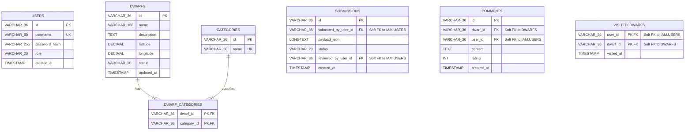

# Projekt Bazy Danych (Database Design)

Niniejszy dokument przedstawia formalny projekt relacyjnej bazy danych (PostgreSQL) dla systemu **Wrocławskie Krasnale**, zaimplementowany zgodnie z rygorystycznymi zasadami **Domain-Driven Design (DDD)** oraz **Architecture-Driven Development (Modular Monolith / MSA)**.

---

### Główne Założenia Architektoniczne Bazy Danych

Zgodnie z wymaganiami kursu dotyczącymi architektury heksagonalnej, EDA oraz paradygmatu SOA/MSA, projekt bazy danych opiera się na trzech fundamentalnych zasadach:

1. **Identyfikatory UUID zamiast sekwencyjnych (AUTO_INCREMENT):** Wszystkie klucze główne są generowane w warstwie domeny (Java) jako unikalne identyfikatory UUID (zapamiętywane w bazie jako `VARCHAR(36)` lub `BINARY(16)`). Uniezależnia to tworzenie obiektów biznesowych od bazy danych.
2. **Miękkie Relacje Międzykontekstowe (Soft Foreign Keys):** Aby zapewnić luźne powiązania (`Loose Coupling`) i umożliwić bezproblemowe wycięcie pakietów do osobnych mikroserwisów w przyszłości, **nie stosujemy fizycznych więzów integralności (`FOREIGN KEY`) pomiędzy tabelami należącymi do różnych Kontekstów Ograniczonych (Bounded Contexts)**. Relacje te są realizowane logicznie w warstwie aplikacji lub poprzez komunikację zdarzeniową (EDA). Fizyczne klucze obce stosujemy wyłącznie wewnątrz tego samego kontekstu (np. relacje wiele-do-wielu dla kategorii).
3. **Izolacja Danych:** Każdy kontekst zarządza wyłącznie swoimi tabelami. Serwisy z jednego kontekstu nie mogą wykonywać operacji `JOIN` na tabelach z innego kontekstu.

---

### Diagram Związków Encji (ERD)

Poniższy diagram Mermaid jest natywnie renderowany przez interfejs GitHub i przedstawia logiczne powiązania struktur z podziałem na Konteksty Ograniczone.

---

### Szczegółowa Specyfikacja Tabel z podziałem na Konteksty

#### 1. Kontekst: Zarządzanie tożsamością i dostępem (IAM Context)
Odpowiada za rejestrację, uwierzytelnianie, logowanie oraz zmianę uprawnień i ról użytkowników systemu.

##### Tabela: `users`
| Nazwa kolumny | Typ danych | Atrybuty | Opis / Biznesowe uzasadnienie |
| :--- | :--- | :--- | :--- |
| `id` | `VARCHAR(36)` | `PRIMARY KEY` | Unikalny identyfikator użytkownika (UUID generowane w Javie). |
| `username` | `VARCHAR(50)` | `NOT NULL, UNIQUE` | Unikalna nazwa użytkownika (login). |
| `password_hash` | `VARCHAR(255)` | `NOT NULL` | Bezpieczny skrót hasła (np. BCrypt) – warstwa infrastruktury bezpieczeństwa. |
| `role` | `VARCHAR(20)` | `NOT NULL` | Rola w systemie. Wartości słownikowe (Enum): `GUEST`, `USER`, `EDITOR`, `ADMIN`. |
| `created_at` | `TIMESTAMP` | `NOT NULL` | Data i czas rejestracji konta w systemie. |

---

#### 2. Kontekst: Krasnale (POI Catalog & Mapping Context)
Odpowiada za kluczową dziedzinę systemu – przechowywanie zweryfikowanych informacji o krasnalach, ich pozycji geograficznej oraz filtrach globalnych.

##### Tabela: `dwarfs`
| Nazwa kolumny | Typ danych | Atrybuty | Opis / Biznesowe uzasadnienie |
| :--- | :--- | :--- | :--- |
| `id` | `VARCHAR(36)` | `PRIMARY KEY` | Unikalny identyfikator Krasnala (UUID). |
| `name` | `VARCHAR(100)` | `NOT NULL` | Oficjalna lub powszechna nazwa Krasnala. |
| `description` | `TEXT` | `NULL` | Opis historyczny, ciekawostki lub szczegóły o obiekcie. |
| `latitude` | `DECIMAL(10, 8)` | `NOT NULL` | Szerokość geograficzna (szeroki zakres dokładności dla Leaflet.js). |
| `longitude` | `DECIMAL(11, 8)` | `NOT NULL` | Długość geograficzna (szeroki zakres dokładności dla Leaflet.js). |
| `status` | `VARCHAR(20)` | `NOT NULL` | Aktualny stan fizyczny obiektu (Enum): `ACTIVE` (widoczny), `HIDDEN` (zasłonięty/usunięty). |
| `updated_at` | `TIMESTAMP` | `NOT NULL` | Czas ostatniej modyfikacji danych obiektu. |

##### Tabela: `categories`
| Nazwa kolumny | Typ danych | Atrybuty | Opis / Biznesowe uzasadnienie |
| :--- | :--- | :--- | :--- |
| `id` | `VARCHAR(36)` | `PRIMARY KEY` | Unikalny identyfikator kategorii globalnej (UUID). |
| `name` | `VARCHAR(50)` | `NOT NULL, UNIQUE` | Nazwa filtra globalnego (np. `krasnal`, `budynek`, `zabytek`, `flora`). |

##### Tabela: `dwarf_categories`
| Nazwa kolumny | Typ danych | Atrybuty | Opis / Biznesowe uzasadnienie |
| :--- | :--- | :--- | :--- |
| `dwarf_id` | `VARCHAR(36)` | `PRIMARY KEY, FK` | Identyfikator krasnala. Fizyczny `FOREIGN KEY` do `dwarfs(id)`. |
| `category_id` | `VARCHAR(36)` | `PRIMARY KEY, FK` | Identyfikator kategorii. Fizyczny `FOREIGN KEY` do `categories(id)`. |

---

#### 3. Kontekst: Zgłoszenia (Verification System Context)
Odpowiada za proces przesyłania propozycji nowych obiektów przez Użytkowników oraz ich ocenę merytoryczną przez Edytorów lub Administratorów.

##### Tabela: `submissions`
| Nazwa kolumny | Typ danych | Atrybuty | Opis / Biznesowe uzasadnienie |
| :--- | :--- | :--- | :--- |
| `id` | `VARCHAR(36)` | `PRIMARY KEY` | Unikalny identyfikator zgłoszenia (UUID). |
| `submitted_by_user_id` | `VARCHAR(36)` | `NOT NULL` | Logiczny klucz (Soft FK). Identyfikator Współtwórcy, który wysłał zgłoszenie. |
| `payload_json` | `LONGTEXT` | `NOT NULL` | **Wzorzec architektoniczny:** Spakowane dane proponowanego krasnala (nazwa, opis, współrzędne, zdjęcia) w formacie JSON. Unika to zanieczyszczania tabeli produkcyjnej `dwarfs` niezweryfikowanymi danymi. |
| `status` | `VARCHAR(20)` | `NOT NULL` | Stan zgłoszenia (Enum): `PENDING` (oczekuje), `APPROVED` (zaakceptowane), `REJECTED` (odrzucone). |
| `reviewed_by_user_id` | `VARCHAR(36)` | `NULL` | Logiczny klucz (Soft FK). Identyfikator Edytora/Admina weryfikującego zgłoszenie. |
| `created_at` | `TIMESTAMP` | `NOT NULL` | Data wpłynięcia zgłoszenia do systemu. |

---

#### 4. Kontekst: Interakcje Użytkownika (Comments & Activity Context)
Odpowiada za rozszerzenia społecznościowe: dodawanie ocen, tekstowych opinii oraz zarządzanie prywatną sekcją obiektów odwiedzonych przez danego użytkownika.

##### Tabela: `comments`
| Nazwa kolumny | Typ danych | Atrybuty | Opis / Biznesowe uzasadnienie |
| :--- | :--- | :--- | :--- |
| `id` | `VARCHAR(36)` | `PRIMARY KEY` | Unikalny identyfikator komentarza (UUID). |
| `dwarf_id` | `VARCHAR(36)` | `NOT NULL` | Logiczny klucz (Soft FK). Identyfikator krasnala, którego dotyczy opinia. |
| `user_id` | `VARCHAR(36)` | `NOT NULL` | Logiczny klucz (Soft FK). Identyfikator Użytkownika będącego autorem wpisu. |
| `content` | `TEXT` | `NOT NULL` | Tekstowa adnotacja i opinia użytkownika o krasnalu. |
| `rating` | `INT` | `NOT NULL` | Ocena krasnala w skali numerycznej (np. od 1 do 5). |
| `created_at` | `TIMESTAMP` | `NOT NULL` | Data i czas dodania komentarza. |

##### Tabela: `visited_dwarfs`
| Nazwa kolumny | Typ danych | Atrybuty | Opis / Biznesowe uzasadnienie |
| :--- | :--- | :--- | :--- |
| `user_id` | `VARCHAR(36)` | `PRIMARY KEY` | Logiczny klucz (Soft FK). Identyfikator Użytkownika, który oznaczył krasnala. |
| `dwarf_id` | `VARCHAR(36)` | `PRIMARY KEY` | Logiczny klucz (Soft FK). Identyfikator odwiedzonego krasnala. |
| `visited_at` | `TIMESTAMP` | `NOT NULL` | Data i czas dodania obiektu do "sekcji odwiedzonych" (filtr lokalny). |

